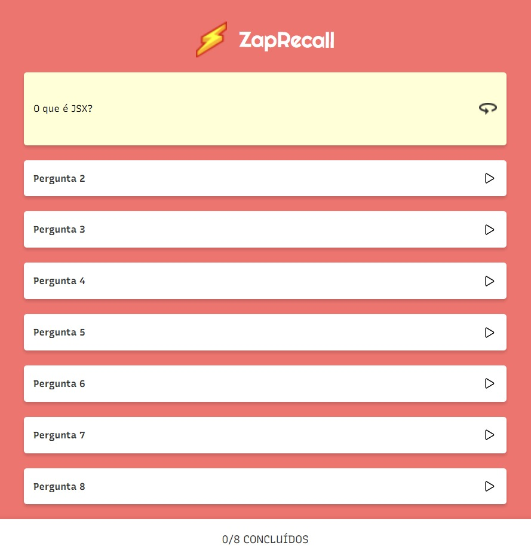

# This is ZapRecall!

Do you ever create small notes to remember subjects that you're studying, so you can keep them fresh inside your head? Say no more!

With ZapRecall, you get a deck with your subject of choice, with randomly-sorted small questions that will help you remember those small notes that you've written.

Just "Start Recall", open a question, and when you turn it back (pressing the circle-arrow), answer appropriately:

🟩 "Zap!" if you immediately knew the answer. (Green goes for Great!)

🟨 "Quase não lembrei" if it took you some thinking to remember the answer (Yellow for... "Yup... I guess?")

🟥 "Não lembrei" if you didn't actually know the answer beforehand (I've got no puns for the Red color I'm sorry)

# Link to deploy

https://projeto8-zaprecall-blue-kappa.vercel.app

# Technologies used to create this project:

